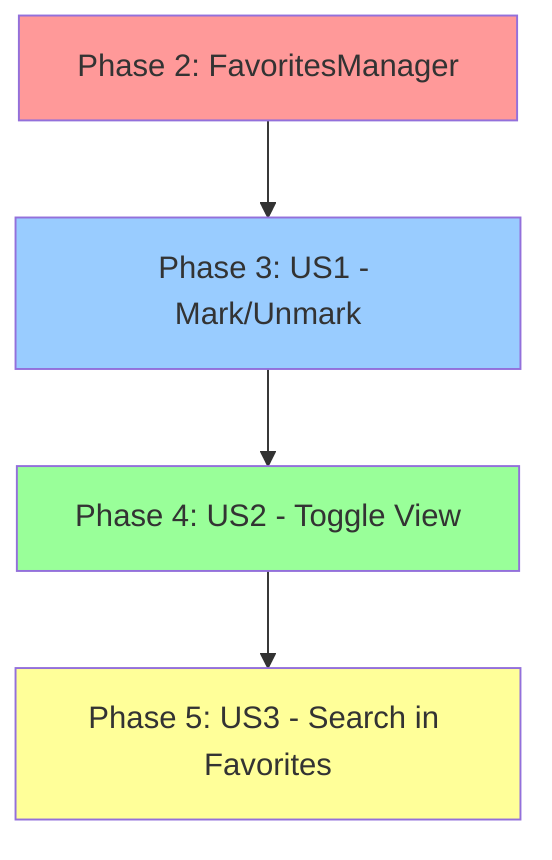

# Tasks: Gestión de Centros Favoritos

**Feature**: 002-favorite-centers  
**Branch**: 002-favorite-centers  
**Input**: Design documents from `/specs/002-favorite-centers/`  
**Prerequisites**: [plan.md](plan.md), [spec.md](spec.md), [research.md](research.md), [data-model.md](data-model.md), [contracts/](contracts/)

## Format: `[ID] [P?] [Story] Description`

- **[P]**: Can run in parallel (different files, no dependencies)
- **[US1]**: User Story 1 - Marcar y Desmarcar Favoritos (P1) 🎯 MVP
- **[US2]**: User Story 2 - Filtrar Vista por Favoritos (P2)
- **[US3]**: User Story 3 - Gestión de Favoritos con Búsqueda (P3)
- Include exact file paths in descriptions

**Path Convention**: Single project with `wifi_connector/` package at repository root

---

## Phase 1: Setup (Shared Infrastructure)

**Purpose**: Verify prerequisites and prepare for implementation

- [X] T001 Verify fav.png and fav_unchecked.png exist in images/ folder
- [X] T002 Verify Json/ directory exists and is writable (test with temp file)
- [X] T003 [P] Audit wifi_connector/data/credentials_manager.py to understand CenterCredentials structure

**Checkpoint**: Prerequisites verified, structure understood

---

## Phase 2: Foundational (Blocking Prerequisites)

**Purpose**: Core FavoritesManager that ALL user stories depend on

**⚠️ CRITICAL**: No user story work can begin until this phase is complete

- [X] T004 Create wifi_connector/data/favorites_manager.py with FavoritesManager class skeleton (imports, __init__, type hints)
- [X] T005 Implement FavoritesManager.load_favorites() with JSON parsing and validation against wifi.json
- [X] T006 Implement FavoritesManager._save_favorites() with atomic write (temp file + rename)
- [X] T007 Implement FavoritesManager.add_favorite() to add center and persist immediately
- [X] T008 Implement FavoritesManager.remove_favorite() to remove center and persist immediately
- [X] T009 Implement FavoritesManager.is_favorite() to check if center is favorited
- [X] T010 Implement FavoritesManager.get_favorites() to return list of favorite centers
- [X] T011 Add auto-cleanup logic in load_favorites() to remove obsolete favorites (centers not in wifi.json)
- [X] T012 Add error handling for corrupted JSON, missing file, write errors (log warnings, don't crash)

**Checkpoint**: FavoritesManager is complete and ready to integrate with GUI

---

## Phase 3: User Story 1 - Marcar y Desmarcar Favoritos (Priority: P1) 🎯 MVP

**Goal**: Usuarios pueden marcar/desmarcar centros como favoritos con iconos clicables en cada fila

**Independent Test**: Hacer clic en icono fav_unchecked.png junto a un centro, verificar que cambia a fav.png y persiste tras reinicio

### Implementation for User Story 1

- [X] T013 [P] [US1] Load fav.png and fav_unchecked.png as CTkImage in MainWindow.__init__
- [X] T014 [US1] Initialize FavoritesManager in MainWindow.__init__ with path Json/favoritos.json
- [X] T015 [US1] Call favorites_manager.load_favorites() in MainWindow.__init__ after credentials load
- [X] T016 [US1] Add view_mode instance variable to MainWindow (initialize to "all")
- [X] T017 [US1] Modify MainWindow._create_center_row() to add favorite icon CTkButton as first column (column 0)
- [X] T018 [US1] Update column indices in _create_center_row() for code label (→ column 1), name label (→ column 2), connect button (→ column 3)
- [X] T019 [US1] Set favorite icon button image based on favorites_manager.is_favorite(center_code)
- [X] T020 [US1] Implement MainWindow._toggle_favorite() method to add/remove favorite and update UI
- [X] T021 [US1] Connect favorite icon button command to _toggle_favorite() with lambda capturing center
- [ ] T022 [US1] Test manually: mark favorite → icon changes → restart app → favorite persists

**Checkpoint**: User Story 1 complete - users can mark/unmark favorites with icon clicks, favorites persist

---

## Phase 4: User Story 2 - Filtrar Vista por Favoritos (Priority: P2)

**Goal**: Usuarios pueden alternar entre ver todos los centros o solo favoritos con botón toggle en header

**Independent Test**: Marcar 2-3 favoritos, clic en toggle button, verificar que solo se muestran favoritos

### Implementation for User Story 2

- [X] T023 [P] [US2] Modify MainWindow._create_header() to add toggle button after search field (before help button)
- [X] T024 [US2] Initialize toggle button with fav_unchecked_icon and command=_toggle_view_mode
- [X] T025 [US2] Update column indices in _create_header() for help button (→ column 3), about button (→ column 4)
- [X] T026 [US2] Implement MainWindow._toggle_view_mode() to switch view_mode between "all" and "favorites"
- [X] T027 [US2] Update toggle button icon in _toggle_view_mode() based on new mode (fav.png for favorites, fav_unchecked.png for all)
- [X] T028 [US2] Clear search field in _toggle_view_mode() per FR-011
- [X] T029 [US2] Call _refresh_center_list() in _toggle_view_mode() to update display
- [X] T030 [US2] Modify MainWindow._filter_centers() to select source_centers from favorites_manager.get_favorites() when view_mode == "favorites"
- [X] T031 [US2] Implement MainWindow._show_empty_message() to display contextual message when list is empty
- [X] T032 [US2] Update MainWindow._update_display() to call _show_empty_message() with appropriate message for empty favorites
- [ ] T033 [US2] Test manually: toggle to favorites → only favorites shown → toggle back → all shown

**Checkpoint**: User Story 2 complete - users can toggle between all centers and favorites view

---

## Phase 5: User Story 3 - Gestión de Favoritos con Búsqueda (Priority: P3)

**Goal**: Búsqueda filtra solo dentro de favoritos cuando modo favoritos está activo

**Independent Test**: Marcar 10+ favoritos, activar modo favoritos, buscar por término, verificar solo favoritos en resultados

### Implementation for User Story 3

- [X] T034 [US3] Verify MainWindow._filter_centers() respects view_mode (already done in T030, just validate)
- [X] T035 [US3] Update MainWindow._update_display() to show contextual message when search in favorites has no results per FR-012
- [X] T036 [US3] Test search in favorites mode filters correctly
- [X] T037 [US3] Test search with no results shows message "No hi ha resultats a favorits per '[término]'. Prova a buscar en tots els centres."
- [ ] T038 [US3] Test that unmarking favorite in search results removes it from display immediately (if in favorites mode)

**Checkpoint**: User Story 3 complete - search behavior correct in both modes

---

## Phase 6: Integration & Error Handling

**Purpose**: Ensure all components work together and handle edge cases gracefully

- [ ] T039 Test full flow: mark favorite → toggle to favorites view → search → unmark → verify disappears
- [ ] T040 Test persistence: mark favorites → close app → restart → verify favorites loaded correctly
- [ ] T041 Test auto-cleanup: manually add obsolete center_code to favoritos.json → restart app → verify removed automatically
- [ ] T042 Test corrupted JSON: corrupt favoritos.json → restart app → verify empty list loads, app doesn't crash
- [ ] T043 Test missing file: delete favoritos.json → restart app → verify empty list loads, no errors
- [ ] T044 Test empty favorites: delete all favorites → activate favorites view → verify message "No tens centres marcats com a favorits"
- [ ] T045 Test search in empty favorites: activate favorites view with no favorites → search → verify appropriate message
- [ ] T046 Test performance: load 100+ favorites → measure load time < 500ms per SC-004

**Checkpoint**: All integration scenarios work, error handling is robust

---

## Phase 7: Unit Tests

**Purpose**: Comprehensive unit test coverage for FavoritesManager

- [X] T047 [P] Create tests/unit/test_favorites_manager.py with test class TestFavoritesManager
- [X] T048 [P] Test load_favorites() with valid favoritos.json file
- [X] T049 [P] Test load_favorites() with missing file returns False and initializes empty list
- [X] T050 [P] Test load_favorites() with corrupted JSON returns False and logs warning
- [X] T051 [P] Test load_favorites() auto-cleanup removes obsolete centers and re-saves file
- [X] T052 [P] Test add_favorite() with valid center adds to list and persists
- [X] T053 [P] Test add_favorite() with duplicate center is idempotent (no error, no duplicate)
- [X] T054 [P] Test remove_favorite() with existing center removes from list and persists
- [X] T055 [P] Test remove_favorite() with non-existing center is idempotent
- [X] T056 [P] Test is_favorite() returns True for favorited center
- [X] T057 [P] Test is_favorite() returns False for non-favorited center
- [X] T058 [P] Test get_favorites() returns copy of favorites list

**Checkpoint**: FavoritesManager has >80% test coverage

---

## Phase 8: Integration Tests

**Purpose**: End-to-end testing of favorites flow

- [ ] T059 [P] Create tests/integration/test_favorites_flow.py with test class TestFavoritesIntegration
- [ ] T060 [P] Test full flow: load favorites → add → persist → reload → verify present
- [ ] T061 [P] Test atomic write: simulate crash during write, verify no corruption
- [ ] T062 [P] Test GUI integration: mock MainWindow, verify toggle updates favorites_manager

**Checkpoint**: Integration tests pass, favorites flow validated end-to-end

---

## Phase 9: Documentation & Polish

**Purpose**: Update documentation and ensure code quality

- [ ] T063 [P] Add docstrings to all FavoritesManager methods with type hints
- [ ] T064 [P] Add docstrings to new MainWindow methods (_toggle_favorite, _toggle_view_mode, etc.)
- [ ] T065 [P] Run ruff check and fix any linting issues
- [ ] T066 [P] Run black formatter on favorites_manager.py and main_window.py
- [ ] T067 Update README.md to document favorites feature in user guide section
- [ ] T068 Update wifi_connector/gui/README.md to document favorites GUI components
- [ ] T069 Run full test suite: pytest --cov=wifi_connector
- [ ] T070 Verify coverage ≥80% for favorites_manager.py

**Checkpoint**: Code is polished, documented, and ready for PR

---

## Dependencies Between User Stories



**Blocking Dependencies**:
- Phase 2 (FavoritesManager) MUST complete before any user story
- Phase 3 (US1) MUST complete before Phase 4 (US2) - need favorites to toggle
- Phase 4 (US2) SHOULD complete before Phase 5 (US3) - search builds on toggle

**Parallel Opportunities**:
- T013 (load icons) can run parallel with T014-T016 (initialize managers)
- T023-T025 (header modifications) can run parallel with T030-T032 (filter logic)
- All unit tests (T047-T058) can run in parallel
- All integration tests (T059-T062) can run in parallel
- All documentation tasks (T063-T068) can run in parallel

---

## MVP Scope (Minimum Viable Product)

**Recommended MVP**: Complete through Phase 3 (User Story 1) only

**Why**: User Story 1 delivers core value - marking favorites. Users can mark favorites even if they can't filter by them yet.

**MVP Includes**:
- Phase 1: Setup ✅
- Phase 2: FavoritesManager ✅
- Phase 3: User Story 1 ✅ (mark/unmark with icon)
- Phase 7: Unit tests for FavoritesManager ✅

**Post-MVP Increments**:
- **Increment 2**: Add Phase 4 (US2 - toggle view)
- **Increment 3**: Add Phase 5 (US3 - search in favorites)
- **Polish**: Add Phase 6, 8, 9 (integration tests, documentation)

---

## Parallel Execution Examples

### During Phase 2 (Foundational)
```bash
# Developer A
T004-T006  # Create class skeleton and core methods

# Developer B (waits for T004)
T007-T010  # Implement remaining CRUD methods

# Developer C (waits for T007-T010)
T011-T012  # Add auto-cleanup and error handling
```

### During Phase 3 (User Story 1)
```bash
# Developer A
T013, T014, T015, T016  # Initialize managers in MainWindow

# Developer B (can work in parallel)
T017, T018, T019  # Modify _create_center_row layout

# Developer C (waits for A and B)
T020, T021  # Implement toggle logic and connect callbacks
```

### During Phase 7 (Unit Tests)
```bash
# All tests can run in parallel by different developers
Developer A: T047-T051  # Load tests
Developer B: T052-T055  # Add/remove tests
Developer C: T056-T058  # Query tests
```

---

## Testing Strategy

### Unit Test Focus
- FavoritesManager methods (load, add, remove, is_favorite, get_favorites)
- Error handling (corrupted JSON, missing file, obsolete centers)
- Atomic write behavior
- Validation logic

### Integration Test Focus
- Full flow: mark → persist → restart → verify
- GUI integration: click → update → refresh
- Auto-cleanup on load
- Performance under load (100+ favorites)

### Manual Test Focus (Checklist in quickstart.md)
- Visual alignment of favorite icons
- Toggle button style matches help button
- Contextual messages display correctly
- No layout breaks with 0, 1, 10, 100+ centers

---

## Performance Targets

- **T046**: Load 100+ favorites < 500ms (SC-004)
- **T022**: Toggle favorite < 50ms (icon update)
- **T033**: Toggle view mode < 100ms (list refresh)
- **T036**: Search in favorites < 200ms

---

## Implementation Strategy

1. **Start with Phase 1-2**: Build solid foundation (FavoritesManager)
2. **User Story 1 first**: Deliver MVP - core marking functionality
3. **Validate with tests**: Phase 7 unit tests before moving to US2
4. **Incremental delivery**: Add US2, then US3, then polish
5. **Test continuously**: Run tests after each phase completion

**Total Tasks**: 70  
**Parallelizable**: ~25 tasks (35%)  
**Estimated Effort**: 
- Phase 1-3 (MVP): 3-4 days
- Phase 4-5 (US2-US3): 2-3 days
- Phase 6-9 (Polish): 2-3 days
- **Total**: 7-10 days

---

## Next Steps

1. ✅ Review this task breakdown with team
2. ✅ Assign tasks to developers
3. ✅ Start with Phase 1 (Setup)
4. ✅ Progress through phases sequentially (except parallel tasks)
5. ✅ Mark tasks complete using `- [x]` as you finish them
6. ✅ Run tests after each phase to validate progress

**Ready to start implementation!** 🚀
